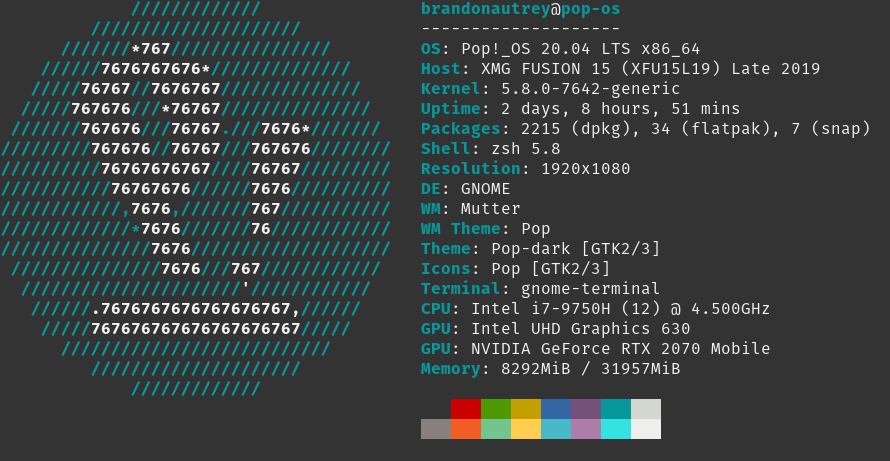

# XMG Fusion 15 Review

Review of my XMG Fusion 15 with Pop_OS

This review comes from the perspective of someone who has not used Linux on their personal computer full-time and coming from Windows/Mac backgrounds. I am a developer who also likes to game casually.

## Specs

### Hardware

- i7-9750H
- Radeon 2070 Max Q
- 32GB RAM
- Samsung 1TB 980 EVO

### Software

- Pop!_OS 20.04 LTS
- Tuxedo drivers: https://www.tuxedocomputers.com/en/Infos/Help-Support/Help-for-my-device/XMG-FUSION-series/XMG-FUSION-15/Intel-QC7-Ubuntu-20-04-installation.tuxedo

## Setup

### Installing Pop_OS

- Use Rufus or Etcher to flash a USB drive
- In the BIOS, set the computer to boot from legacy mode so that the USB stick can be recognized as a boot device
- Standard installation procedure should start

### Installing drivers

#### Tuxedo drivers

https://www.tuxedocomputers.com/en/Infos/Help-Support/Help-for-my-device/XMG-FUSION-series/XMG-FUSION-15/Intel-QC7-Ubuntu-20-04-installation.tuxedo
Order of installation:
-

Receive automatic updates: https://www.tuxedocomputers.com/en/Infos/Help-and-Support/Instructions/Add-TUXEDO-Computers-software-package-sources.tuxedo

#### Other drivers

Awesome keyboard backlight driver to customize per key RGB: https://github.com/pobrn/ite8291r3-ctl

## First Impressions

Very nice computer.

### Hardware

- The USB ports are very tight and they hold in USB devices very strong. It takes some muscle to put them in and pull them out
- Same with the microphone jack, it is very strong and hard to put in and pull out.

#### GPU

- On dedicated Nvidia graphics mode, the computer gets noticably hotter. The chasis where your palms rest get pretty hot. Yet, the keyboard remains cool because you can feel the air being sucked in through the keyboard.
- The fans don't get too loud when using all of the GPU

#### Keyboard

- The keyboard definately takes some getting used too. Sometimes the keys do not type when I press them. I feel like it is harder to type faster, because the keys are consistently not being pressed. This may be because I was used to a Mac chicklet keyboard, where barely any force is needed.
- The keys feel like they are bigger and more spaced out than the macbook I was uses before.
- I am also consistently accidently brushing the trackpad when I'm typing, causing the cursor to go to another part of the paragraph. This can be fixed by using a mouse and disabling the trackpad.

#### Sound

Easily the worst part of this laptop. There are two tiny speakers at the bottom on each side. The speaker strength they put out are not very high

## Issues

### Software

1. Text is missing after resuming from sleep.
  Ex: https://askubuntu.com/questions/795278/how-to-fix-missing-characters-from-font-after-awakening-from-suspend
  Ex: https://pop-planet.info/forums/threads/text-in-gnome-disappears.795/
  - restarting the shell seems to fix the issue

### Hardware

1. Touchpad light for on/off does not light up

2. Keyboard per key RGB and lightbar is not configurable
    a. Maybe using this software will help: https://www.reddit.com/r/XMG_gg/comments/hrv2qb/xmg_fusion_15_per_key_rgb_backlight_lightbar/

3. Error on startup: `Apr 16 14:05:37 pop-os kernel: usb usb2-port1: Cannot enable. Maybe the USB cable is bad?`. To see messages: `journalctl -f`
  - It seems that my left USB port does not work... But the two on the right do work. No idea why, I believe ths one used to work.
  - This port seems to be the USB-A 3.2 Gen 2.

## Applications

### Dropbox

- Linux version is missing many of the Pro features such as smart sync.

### Microsoft OneNote

- Linux wrapper around the onenote browser is available: https://www.npmjs.com/package/p3x-onenote/v/2020.10.120, https://www.electronjs.org/apps/p3x-onenote

#### Problems:
- Application text is mixed. Part of the UI is in Estonian, and English. The language settings does not seem to be configurable and it might take the language from your location or where your account is registered with. I use onenote with a EE (Estonian) email address.
  - https://github.com/patrikx3/onenote/issues/14

### Microsoft Teams

- Available from Microsoft official site: https://www.microsoft.com/en-us/microsoft-teams/download-app#allDevicesSection

#### Problems:
- Microphone does not work in teams. The microphone does work on Zoom, so its not a hardware or software problems with my setup.
- Missing some features such as background bluring.

### Microsoft ToDo

Unofficial, community driven port: https://snapcraft.io/ao

- Seems to work fine and has all the features the original app has.
- Last updated: 21 May 2019. May not have some of the newer features from the official app.

## Gaming

Steam is installed via Flatpak. Steam Proton is set to experimental.

Gaming is more consistently better performing when the laptop is set to only use Nvidia GPU instead of the Hybrid one. There may be an issue where the laptop is not switching GPU properly.

### Civilization VI

- Native Linux mode

Problems running natively without configs:
- Graphics driver in menu says "unknown"
- Performance problems. Graphics seem slow and character animations are laggy. Some UI glitches where cannot select certain things such as city production, etc. Mostly playabe but not  enjoyable.

On the steam launch options, this line must be added to improve performance: `LD_PRELOAD=/usr/lib/libfreetype.so.6 %command%`
The game becomes playable with this fix, however there are still problems
- graphics are laggy
- graphics card is unknown
- sound stops playing after playing the game awhile.

I suspect, that the game is not switching the laptop to use the dedicated GPU and is instead using the integrated Intel GPU, which can be the cause for hte bad graphics performance.

### Civilization V

#### With Lekmod

Lekmod (multiplayer mod), has to run under a Windows environment.

### Hades

Runs perfectly on Proton. Save file syncs across across platforms.

#### Issues

- Sometimes launches with a black screen. Restarting the computer usually fixes this.
- Sometimes switching between full screen game and other windows, causes the game to black out the screen.

### Witcher 3

